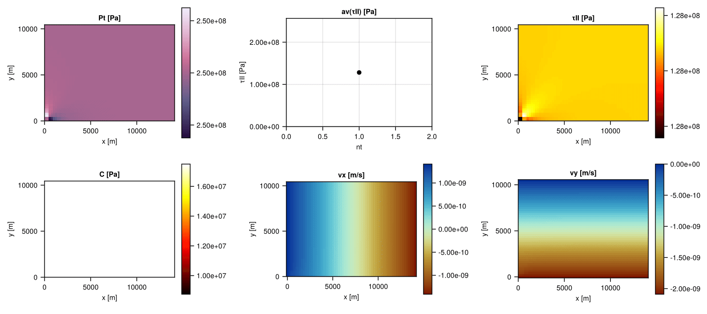

+++
using Dates

title = "Julia hackathon v7.0 2025 - Outcome"
date = Date(2025, 04, 04)
reading_time = "3-minutes read"

tags = ["activities", "julia", "coding"]
+++

\toc

We held our seventh GPU4GEO Julia hackathon on March 24-28, 2025 in Black Forest (DE), focussing on a wide range of Julia topics. Hereafter a glimpse into the progress made by some participants on various Julia-related projects and some visual impressions.

> 🚧 more news to come!

## Chmy.jl - New docs rendering and distributed fix

*Albert de Montserrat, Ivan Utkin, Ludovic Räss*

Content here

## Jaumann stress rate in viscoplastic regularization routines

*Lorenzo Candioti*

During this edition of the Hackathon, I was working on viscoplastic regularization into a 2D Stokes solver for deforming viscoelastoplastic materials. The solver is based on the accelerated pseudo-transient method with an implicit time integration. Non-dimensionalization of physical quantities is not required and the algorithm can handle both dimensional and non-dimensional input parameters. One of my main outcomes of Hackathon v7 is the incorporation of stress advection and rotation expressed via the Jaumann stress rate into the standard regularization routine. My aim is to use the developments of this week as a foundation for future software that simulates multi-phase reactive flow within transcrustal magmatic systems.

