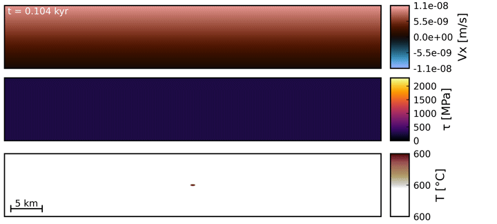
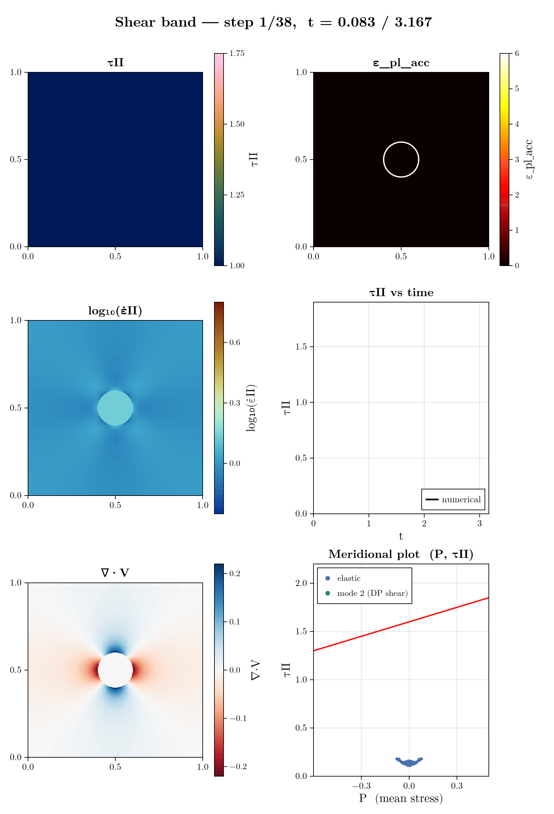

+++
using Dates

title = "Julia hackathon v9.0 2026 - Outcome"
date = Date(2026, 05, 13)
reading_time = "3-minutes read"

tags = ["activities", "Julia", "coding"]
+++

\toc

We held our seventh 9th ∂GPU4GEO Julia hackathon on march 16-20, 2026 in Black Forest (DE), focussing on a wide range of Julia topics. Hereafter a glimpse into the progress made by some participants on various Julia-related projects and some visual impressions...

...but first a glimpse into
<!-- ~~~

    

~~~ -->
the hackathon's daily routine.

## Adding full Advection for variable grid spacing

*Arne Spang & Albert de Montserrat*

Albert and I worked on adding particle-in-cell advection ([JustPIC](https://github.com/JuliaGeodynamics/JustPIC.jl)) to my 2D thermal runaway code ([DEDLoc](https://github.com/ArneSpang/DEDLoc)). This work already started last hackathon and we had to deal with several challenges including variable grid spacing, differences in discretization, minimizing interpolations and adding stress rotations. But we ultimately succeeded. JustPIC now supports variable grids ([#PR 269](https://github.com/JuliaGeodynamics/JustPIC.jl/pull/269)) and DEDLoc now has advection of temperature and stresses, including rotations. It works on CPU and GPU. 

This addition makes DEDLoc much more reliable in accurately describing the strong temperature contrasts at extreme deformation rates. Also thanks to Ivan, Ludovic and Albert (again) for a fruitful discussion about how to optimize the convergence criteria and minimize unnecessary iterations.

    

## Testing new Julia packages for implicit Stokes solvers

*Hugo Dominguez and Jacob Frasunkiewicz*

Jacob and I worked on a proof-of-concept 2D implicit Stokes solver using nonlinear visco-elasto-plastic rheology. The idea was to see if we could combine different Julia packages together to simplify the writing of implicit systems, to make it easier to add new physics, while retaining good performance. I also wanted to understand how to include complex rheology in a Stokes code, which Jacob had much more experience than me doing.

The packages we mostly wanted to try and combined were:

- [ComponentArrays.jl](https://github.com/SciML/ComponentArrays.jl)
- [SparseConnectivityTracer.jl](https://github.com/adrhill/SparseConnectivityTracer.jl)
- [NonlinearSolve.jl](https://github.com/SciML/NonlinearSolve.jl)

Each of these packages solves one piece of the problem, and the reason the combination works is that they all agree on the same interface: a residual function f!(res, u) acting on a generic array-like u that contains all the unknowns of the system we want to solve.

In particular, ComponentArrays.jl gave us a way to keep u structured without giving up the flat-vector interface every solver expects. Instead of tracking u[1:N] as velocities, u[N+1:2N] as pressure, and so on by hand, we could write u.Vx, u.Vz, u.P directly in the residual, while the array underneath is still just a Vector{Float64} as far as the linear algebra is concerned. That works particularly well for staggered grid, where the size of P differs from Vx and Vz. As such, each field is just a view from a long vector. It means that the residual code stays readable and can be written in an explicit manner without any cost in performance.

SparseConnectivityTracer.jl traces the residual function once and hands back the sparsity pattern automatically, so the pattern is always correct for whatever physics is currently in the residual, with no manual bookkeeping to maintain. The trick to have good performance for discretised system is to use the tracer type `Set{Int}`, compared to the default `BitSet`. That makes it scale linearly with the number of connectivity and allowed us to get total sparsity pattern in less than 30 sec for a 800x800 grid.

NonlinearSolve.jl is the part that ties the other two together into something that runs in a black-box-like solver. It takes the residual, the sparsity pattern, and (via [ForwardDiff.jl](https://github.com/JuliaDiff/ForwardDiff.jl)) the means to fill in the Jacobian, and drives the actual Newton iterations (the linear solve at each step via [LinearSolve.jl](https://github.com/SciML/LinearSolve.jl), line search, convergence tolerances etc..) through a generic interface that doesn't care about any of our specific physics.

Here is the result for our 2D shear band setup:

  

## Topic 1

*author*

Content
